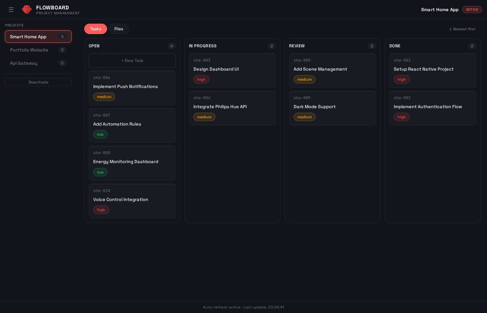

# FlowBoard

[](https://github.com/rasimme/FlowBoard)
[](LICENSE)
[](https://github.com/rasimme/FlowBoard/releases)

> **File-based project management with Kanban dashboard for OpenClaw agents.**

Stop re-explaining context. Work on multiple projects with persistent state, structured task tracking, and a beautiful live dashboard — without needing separate agents.



---

## The Problem

When working on different projects with an AI agent, **context gets lost** between sessions. The agent doesn't remember which project you're working on, what decisions were made, or what's next. You spend time re-explaining everything.

Separate agents per project? That's heavyweight: each needs its own config, workspace, memory store, and API profile. For most projects, that's **overkill**.

## The Solution

**FlowBoard** uses a lazy-loading, file-based approach:

- ✨ **Zero overhead** when no project is active
- 🎯 **Instant context switching** — One command loads full project state
- 📋 **Structured task tracking** — Tasks survive restarts, visible in Kanban UI
- 🔄 **Automatic task updates** — Agent tracks progress in real-time
- 💾 **Session persistence** — Context survives gateway restarts

**How it works:** A tiny trigger in `AGENTS.md` checks for an active project on session start. When you activate a project, the agent loads rules + context. Tasks are tracked in `tasks.json`, visible on a live Kanban dashboard. When you switch projects or restart the gateway, everything just works.

---

## Features

- 📋 **Task Management** — Structured `tasks.json` with status workflow (open → in-progress → review → done)
- 🎯 **Kanban Dashboard** — Interactive web UI with drag & drop, inline editing, auto-refresh
- 📁 **File Explorer** — Browse, preview, and edit project files directly in the dashboard
- 🔄 **Live Task Workflow** — Agent updates task status as it works
- ✨ **Auto-task Creation** — Agent breaks down work into tasks automatically
- 🔗 **API-Based Switching** — Dashboard + chat use same API, instant context loading
- 💾 **Session Persistence** — Project context survives gateway restarts
- 🚀 **Zero Overhead** — Lazy-loading, only active when needed

---

## Quick Start

```bash
# 1. Clone into your OpenClaw workspace
cd ~/.openclaw/workspace
git clone https://github.com/rasimme/FlowBoard.git projects/project-mode

# 2. Set up AGENTS.md trigger
# Add to your ~/.openclaw/workspace/AGENTS.md:

## Projects (MANDATORY)
MANDATORY on EVERY first message: read `ACTIVE-PROJECT.md`.
- If active: read `projects/PROJECT-RULES.md`, then the project's `PROJECT.md`
- If empty: work normally

Commands: "Projekt: [Name]" | "Projekt beenden" | "Projekte"

# 3. Create project structure
mkdir -p ~/.openclaw/workspace/projects
cp -r projects/project-mode/templates/* ~/.openclaw/workspace/projects/

# 4. Start dashboard (optional)
cd ~/.openclaw/workspace/canvas
cp -r ../projects/project-mode/dashboard/* .
node server.js &
```

Open http://localhost:18790 to see your Kanban board.

**For production:** Set up a systemd service for auto-start (see docs/).

---

## Commands

- `Projekt: [Name]` — Activate project (loads context)
- `Neues Projekt: [Name]` — Create new project
- `Projekt beenden` — Deactivate project
- `Projekte` — List all projects

---

## Architecture

### File Structure

```
~/.openclaw/workspace/
├── AGENTS.md                          # Trigger (mandatory)
├── ACTIVE-PROJECT.md                  # Current project state
├── projects/
│   ├── PROJECT-RULES.md               # System rules (loaded on demand)
│   ├── _index.md                      # Project registry
│   ├── my-project/
│   │   ├── PROJECT.md                 # Project context
│   │   ├── tasks.json                 # Task tracking
│   │   └── context/                   # Specs, docs, etc.
│   └── another-project/
│       └── ...
└── canvas/                            # Dashboard
    ├── index.html                     # Main HTML
    ├── server.js                      # Express API server
    ├── styles/
    │   └── dashboard.css              # Styles
    └── js/
        ├── utils.js                   # Shared utilities
        ├── kanban.js                  # Kanban view module
        └── file-explorer.js           # File explorer module
```

### Key Principles

1. **Lazy Loading** — Only load what's needed
2. **File-based Conventions** — No custom hooks required
3. **Single Source of Truth** — ACTIVE-PROJECT.md + tasks.json
4. **Graceful Degradation** — Errors = "no project active"
5. **Modular Frontend** — Clean separation of concerns

---

## Task Management

Each project gets a `tasks.json`:

```json
{
  "tasks": [
    {
      "id": "T-001",
      "title": "Set up authentication",
      "status": "in-progress",
      "priority": "high",
      "created": "2026-02-10T10:00:00Z",
      "updated": "2026-02-10T14:30:00Z"
    }
  ]
}
```

**Task Workflow:**
```
open → in-progress → review → done
```

**Rules:**
- Agent works on ONE task at a time
- Status updates in real-time as agent works
- Manual confirmation moves tasks to "done"
- Unplanned work creates new tasks automatically

---

## Dashboard

The Kanban dashboard provides:

- **Tasks View:** Drag & drop kanban board with 4 columns
- **Files View:** File tree with Markdown/JSON preview and inline editing
- **Live Updates:** Auto-refresh every 5 seconds
- **Inline Editing:** Click to edit, drag to change status
- **Priority Management:** Visual indicators with popover selector
- **Context Health:** File size tracking with warnings

**Access:** http://localhost:18790

The file explorer lets you browse your entire project structure, preview Markdown and JSON files with syntax highlighting, and edit files inline — all without leaving the dashboard.


---

## Related Projects

- **[ContextVault](https://github.com/rasimme/ContextVault)** — Advanced memory management with session persistence
- **[openclaw-skills](https://github.com/rasimme/openclaw-skills)** — Collection of OpenClaw skills and plugins

---

## Changelog

### v2.4.0 (2026-02-15) — Modular Frontend
- **JavaScript module refactoring** — Separated Kanban and File Explorer into clean modules
- **Improved code organization** — utils.js, kanban.js, file-explorer.js
- **Better maintainability** — Clear separation of concerns
- **Enhanced documentation** — Updated architecture diagrams

### v2.3.0 (2026-02-14) — Production Ready
- **API-based project switching** — Dashboard + chat use same endpoint
- **Wake events** — Instant context switching without /new
- **project-context Hook** — Automatic BOOTSTRAP.md generation
- **Webhook integration** — System events to agent
- **End-to-end tested** — Dashboard + chat verified

### v2.2.0 (2026-02-14)
- File Explorer with tab system
- Markdown & JSON preview with syntax highlighting
- Inline file editing
- Context health tracking

### v2.1.1 (2026-02-14)
- Memory-flush integration for session persistence
- SESSION-STATE.md reminder after compaction

### v2.1.0 (2026-02-13)
- Dashboard systemd auto-start service
- Port 18790
- UI polish

### v2.0.0 (2026-02-12)
- Task management system with tasks.json
- Kanban Dashboard with drag & drop
- Task workflow rules
- Auto-task creation

---

## Philosophy

- 🎯 **Simplicity** — No unnecessary complexity
- 💰 **Low cost** — Efficient token usage
- 🔒 **Privacy** — Everything runs locally
- ⚡ **Automatic** — Self-maintaining

---

## License

MIT © 2026
